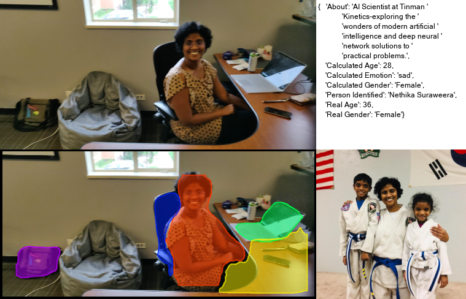

## To Run: 

1. `python run_analysis.py`

(wait till you see “INFO..............Waiting for Images....”)

2. `python main.py`

3. On browser, go to: 
`http://localhost:5000/`

## Results

## Features:

- Object Recognition  - Yolo3, Mask R-CNN
- Face Detection  - dlib
- Age Detection
- Gender Detection
- Facial emotion recognition

